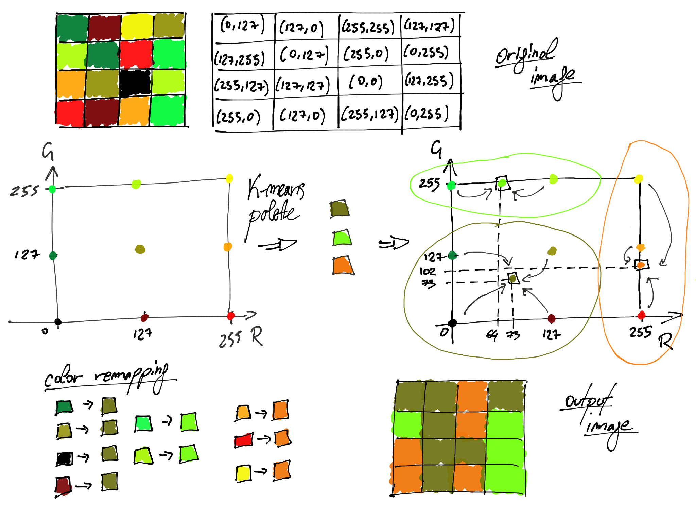
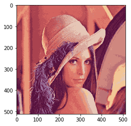

## Problema 5 - Compressão de Imagens
* Novas Tendências -- Machine Learning  
* Projeto Hefesto  
* Facilitadora: Elloá B. Guedes  
* Repositório: http://github.com/elloa/hefesto  
* Nome:  
* E-mail  


```python
## Reservado para bibliotecas
from PIL import Image
import matplotlib.pyplot as plt
import pandas as pd
from sklearn.cluster import KMeans
import numpy as np
from sklearn.utils import shuffle
from sklearn.metrics import pairwise_distances_argmin
import os
```

### Abertura das Imagens e Obtenção dos Pixels

0. Necessário instalar o Pillow no Anaconda  
   * conda install pillow
1. Abrir a imagem lenna.jpg utilizando biblioteca PIL. A imagem esta no diretório local
2. Exibir a imagem original
3. Obtenha, com o auxílio de os, o tamanho da imagem original
    * os.path.getsize


```python
## Necessário importar: from PIL import Image
lenna = Image.open("lenna.png")
```


```python
# Exibir a imagem original. Necessário importar matplotlib.pyplot as pl
imgplot = plt.imshow(lenna)
```


## Conhecendo e Preparando o Exemplo


1. Obtenha a largura e a altura da imagem por meio dos atributos height e width
2. Obtenha os pixels da imagem com a função getdata()
3. Crie um DataFrame com as colunas R, G e B a partir das cores únicas existentes na imagem
4. Visualize o cabeçalho do DataFrame
5. Quantas cores distintas a imagem possui?


```python
height = lenna.height 
width = lenna.width
d = 3
```


```python
# Obtendo uma lista de pixels da imagem
data = list(lenna.getdata())
```


```python
## Visualize o DataFrame
## Conte a quantidade de cores diferentes nele presentes
coresOriginais = pd.DataFrame(set(data),columns=['R','G','B'])
```


```python
len(coresOriginais)
```


    148279


## Quantização de imagens com Aprendizado Não-Supervisionado

* Uma imagem digital é uma matriz de pixels, em que cada pixel é uma tripla de números inteiros correspondendo aos parâmetros de cor no esquema RGB.  
* A quantização de imagens é um esquema simples de compressão com perdas que substitui cores similares por uma única cor. 
* Atuando desta forma, a quantização reduz o tamanho da imagem final, uma vez que menos bits são requeridos para representar as cores.



### Primeira Estratégia de Compressão: 16 Cores

* Utilizar o algoritmo k-means com k=16 com as cores únicas da imagem
* Efetuar o treinamento com estes dados
* Prever com o modelo treinado e redesenhar a imagem original
   * Observe que é necessário redimensionar os dados para 512 x 512
   * Utilize a biblioteca numpy
* Salvar a imagem e comparar o tamanho com a imagem original
* Utilize a biblioteca os para obter o tamanho da imagem
    * os.path.getsize


```python
## Necessário importar from sklearn.cluster import KMeans
modelo = KMeans(n_clusters=16)
modelo.fit(data)
```


    KMeans(algorithm='auto', copy_x=True, init='k-means++', max_iter=300,
           n_clusters=16, n_init=10, n_jobs=None, precompute_distances='auto',
           random_state=None, tol=0.0001, verbose=0)


```python
# Mapeamento de cores para centróides
def predict(modelo,dataset):
    labels = list(modelo.fit_predict(dataset))
    centroides = list(map(tuple, modelo.cluster_centers_.astype(int)))
    return centroides,labels
```


```python
colors,labels = predict(modelo,lenna.getdata())
```


```python
# Vai reconstruir a imagem com as novas cores
def compressed_im(height,width,colors,labels):
    new_image = Image.new(mode='RGB',size=(width,height))
    index = 0
    for i in range(height):
        for j in range(width):
            new_image.putpixel((j,i),colors[labels[index]])
            index+=1
    return new_image
```


```python
nova = compressed_im(height,width,colors,labels)
```


```python
plt.imshow(nova)
```


    <matplotlib.image.AxesImage at 0x1a2098f390>





```python
nova.save(str(16) + '_new_image.jpg')
```


```python
os.path.getsize("16_new_image.jpg")
```


    0.09956976172132441


### Primeira Estratégia de Compressão: 32 Cores

* Repita o processo e compare o tamanho das imagens com as anteriores


```python

```
